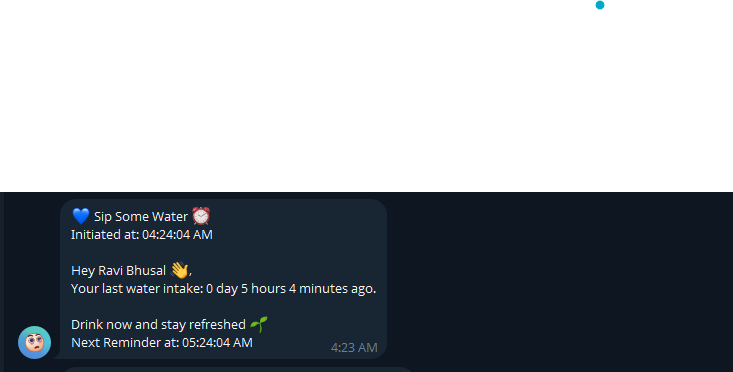
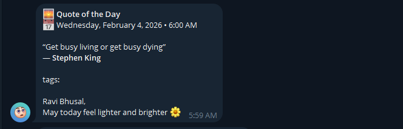
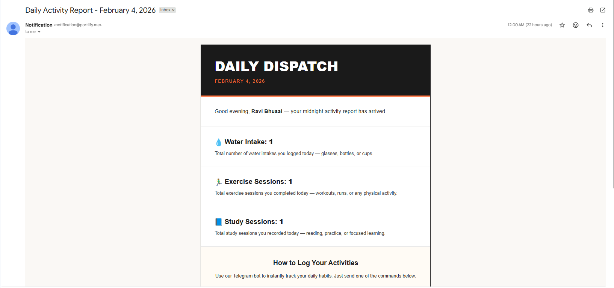

# Notification Platform

Multi-channel notification system that helps users stay on top of hydration, workouts, study blocks, quotes of the day, and automated midnight summaries. The platform blends a Telegram bot, Resend-powered email reports, a BullMQ scheduling layer, and a React dashboard so users can inspect and tune their notification cadences.

## Core Capabilities
- Unified BullMQ scheduler that fans out hydration, exercise, quote, and midnight email jobs through Redis workers.
- Telegram bot onboarding that links users to their accounts, enables specific tasks (`/water`, `/exercise`, `/study`), logs actual activity via `/input <task>`, and keeps streaks accurate.
- Midnight email digest that enumerates yesterday’s completed tasks and ships through Resend with rich HTML templates.
- Quote-of-the-day push at local 6 AM with rotating closers, tags, and metadata retrieved from FavQs.
- React + Vite dashboard that surfaces subscription cards, daily streak metrics, and a fully interactive “Update Center” for customizing cadence, timezone, and enablement per task.

## Architecture At A Glance
| Surface | Stack | Purpose |
| --- | --- | --- |
| API/worker | Express 5, BullMQ, Redis 5, PostgreSQL 15 | Processes routes, hands off scheduled jobs, persists task usage, and tracks cadence windows. |
| Messaging | node-telegram-bot-api, Resend | Telegram bot handles onboarding + reminders; Resend delivers daily email summaries. |
| Frontend | React 19, Vite 7, Tailwind v4, Framer Motion | Subscription dashboard, streak visualization, and notification update tools. |
| Auth | better-auth | Google OAuth, session storage (PostgreSQL) with Node handlers exposed at `/api/auth/*`. |

## Backend Functionality
### Express APIs
- `GET /api/healthcheck` confirms uptime.
- `GET /api/userinfo/:userid` lists active notifications with cadence, timezone, and descriptions for the React dashboard cards.
- `GET /api/userstreak/:userid` counts same-day task activity for the streak widget.
- `GET /api/updateget/:userid` + `PUT /api/updateput/:userid` fetch and mutate per-task cadence (interval vs fixed time), timezone, and enablement flags used by the Update Center.

### BullMQ Scheduler + Workers
- `schedular` queue (see `backend/server.js`) upserts four recurring jobs every minute and dispatches: `DrinkWater`, `Exercise`, `MidNight_Report`, and `Quote_Of_The_Day`.
- Each job fans out user-specific payloads by querying PostgreSQL for eligible users (time window met, throttle interval observed, and Telegram link active).
- Completion hooks stamp `taskuser.lastcheck` while retry/backoff policies keep runaway jobs in check.

### Telegram Bot (`backend/services/telegram.js`)
- `/activateNotify <email>` links a Telegram account to an existing user record and stores chat metadata.
- `/water`, `/exercise`, `/study` toggle specific task subscriptions by flipping the `taskuser.isactive` flag.
- `/input water|exercise|study` logs manual completion, updates `last_user_activity`, and inserts a `taskactivity` record so streaks reflect real behavior.
- Incoming reminders randomly choose from contextual templates defined in `backend/services/messages.js` so messages feel human.

### Midnight Email Digest
- `enqueueMindNightReport()` (from `backend/queue/gmailMessages.js`) compiles the previous day’s counts per user and glues them into a branded HTML template.
- Resend handles delivery from `notification@portlify.me`. Successful sends also advance `taskuser.lastcheck` for the midnight report task.

### Quote of the Day
- `enqueueqotd()` fetches FavQs’ quote of the day only when subscribers exist in the current 6:00–6:15 window for their timezone.
- Worker sends Markdown-rich Telegram messages with author, tags, and rotating closers that match the product tone.

## Frontend Experience
- **Landing + Auth**: Minimal navbar with Google sign-in powered by Better Auth; successful login routes to `/main`, while first-time users hit `/welcome` for onboarding.
- **Notification Subscription Hub**: `App.tsx` renders cards for each active task, surfaces timezone and notify-after cadence, and exposes immediate refresh buttons.
- **Daily Streak Monitor**: Realtime fetch to `/api/userstreak/:userid` summarises how many times each task was performed today.
- **Update Center (`src/components/ui/Update.tsx`)**: Allows toggling `isactive`, editing `notify_after` intervals (with inline validation like “15 minutes”, “2 hours”), selecting timezones (via `react-timezone-select`), and adjusting fixed send times for tasks that support it. Animated status cards confirm success/failure with `framer-motion`.

## Notification Flows
- **Drink Water**: Interval-based reminder triggered whenever both `last_user_activity` and `lastcheck` exceed the configurable `notify_after`. Telegram queue chooses randomized hydration copy and updates `lastcheck` upon delivery.
- **Daily Exercise**: Fixed-time reminder (default 15:45 local) that fires within a five-minute window and respects the same throttle fields.
- **Study Session**: Logged via `/study` and `/input study`; included in midnight report metrics.
- **Midnight Report**: Executes shortly after local midnight, aggregates previous-day counts, and sends an HTML email recapping water, exercise, and study activity.
- **Quote of the Day**: Fires at 6 AM local, fetches a fresh quote, and logs `lastcheck` to avoid duplicate sends.

## Local Setup
### Requirements
- Node.js 20+
- PostgreSQL 15+ (accessible via a single `POSTGRES_CONNECTION_STRING`)
- Redis 6+
- Resend API key + Telegram Bot token

### Backend Environment
Create `backend/.env` with at least:
- `POSTGRES_CONNECTION_STRING`
- `BETTER_AUTH_URL`
- `GOOGLE_CLIENT_ID`, `GOOGLE_CLIENT_SECRET`
- `REDIS_HOST`, `REDIS_PORT`, `REDIS_USERNAME`, `REDIS_PASSWORD`
- `TELEGRAM_TOKEN`
- `RESEND_API_KEY`
- `API_KEY_QUOTES` (FavQs API token)

Bootstrap steps:
1. `cd backend && npm install`
2. Run migrations: `psql "$POSTGRES_CONNECTION_STRING" -f backend/better-auth_migrations/2026-02-07T15-20-45.441Z.sql`
3. Start workers/API: `npm run dev` (nodemon) or `npm start`
4. Optional: invoke `node scripts/runMidnightReport.js` to manually enqueue nightly digests.

### Frontend Environment
- `cp .env.example .env` (if present) or create `.env` in the repo root with `VITE_API_BASE_URL=http://localhost:3000`
- Update `lib/auth-client.ts` if your Better Auth host differs from `http://localhost:3000`.

Install + run:
1. `npm install`
2. `npm run dev`
3. Visit `http://localhost:5173` (auth flows will bounce through the backend’s `/api/auth/*`).

## Development Notes
- Queues (`schedular`, `telegram`, `gmail`, `qotd`) require Redis connectivity; ensure the Redis URI matches your `.env` before relying on scheduled jobs.
- The React dashboard currently seeds `userid` with `b81b63da-0487-446d-9ea2-b62d852ea3bd`; wire it up to Better Auth session data when integrating real accounts.
- `src/components/index.css` registers custom Mabry Pro fonts; keep assets under `src/assets/fonts` in sync if you tweak typography.

## Visual Preview

